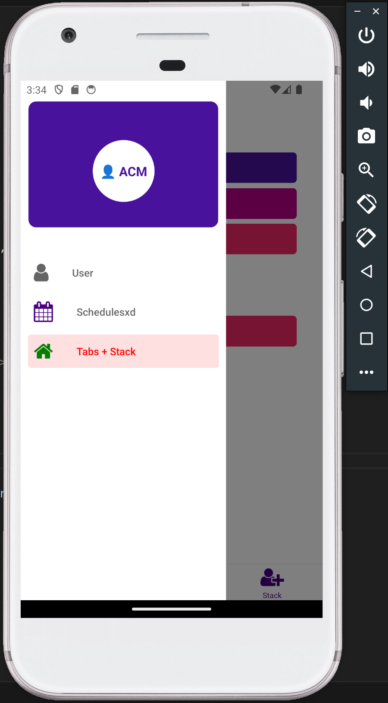
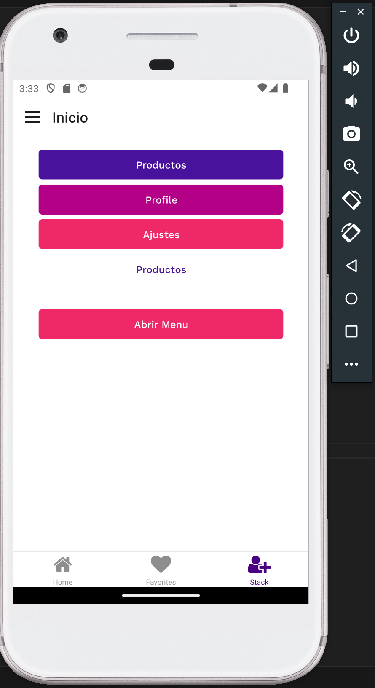
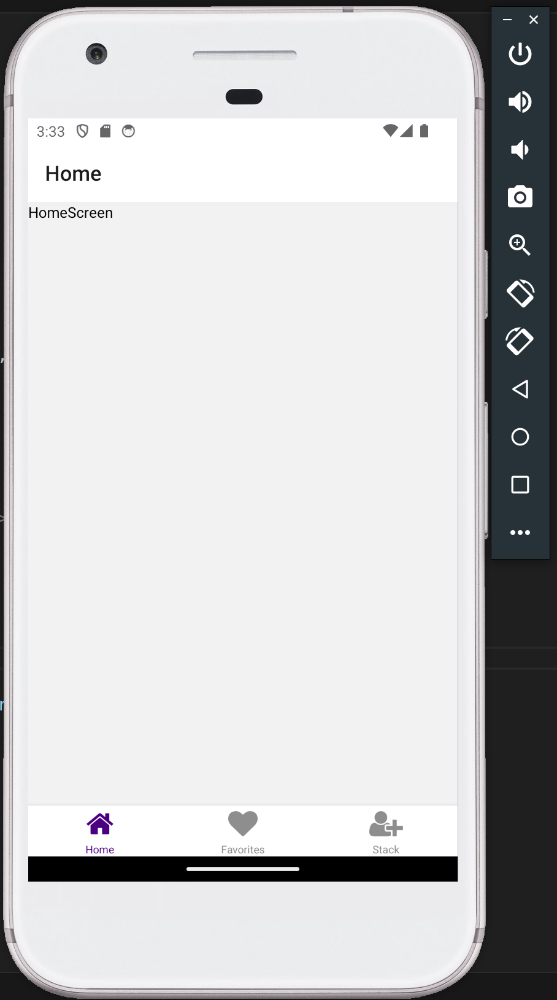

# Expo Navigation App

This is a React Native project using Expo to demonstrate navigation between different screens. The app includes examples of stack navigation, tab navigation, and drawer navigation.

## Recomendations before install 

Before you begin, ensure you have the following installed:

- **Node.js**: We recommend using the latest LTS version.
- **Bun**: A fast JavaScript runtime. You can install it from [bun.sh](https://bun.sh).
- **Expo CLI**: Install it globally using npm, yarn, or bun:
   ```sh
   bun add -g expo-cli
   ```
- **Android Studio** (for Android development) or **Xcode** (for iOS development).

Alternatively, you can use **pnpm** as a package manager instead of bun:
- Install pnpm globally:
   ```sh
   npm install -g pnpm
   ```
- Use pnpm to install dependencies:
   ```sh
   pnpm install
   ```
- Start the project with pnpm:
   ```sh
   pnpm run android
   ```

## Features

- Stack Navigation
- Tab Navigation
- Drawer Navigation
- Customizable themes
- Responsive design

## Installation

1. Clone the repository:
   ```sh
   git clone https://github.com/AlanMelendez/tabs-app-react_native.git
   ```
2. Navigate to the project directory:
   ```sh
   cd expo-navigation-app
   ```
3. Install dependencies:
   ```sh
   bun install
   ```
4. Start the project:
   ```sh
   bun run android
   ```

## Usage

- To start the app on an Android or iOS emulator, press `a` or `i` respectively after running `bun start`.
- To start the app on a physical device, scan the QR code generated by Expo.

## Screenshots

### Drawer Navigation


### Stack Navigation


### Tab Navigation



## Contributing

Contributions are welcome! Please open an issue or submit a pull request for any changes.

## License

This project is licensed under the MIT License. See the [LICENSE](./LICENSE) file for details.
